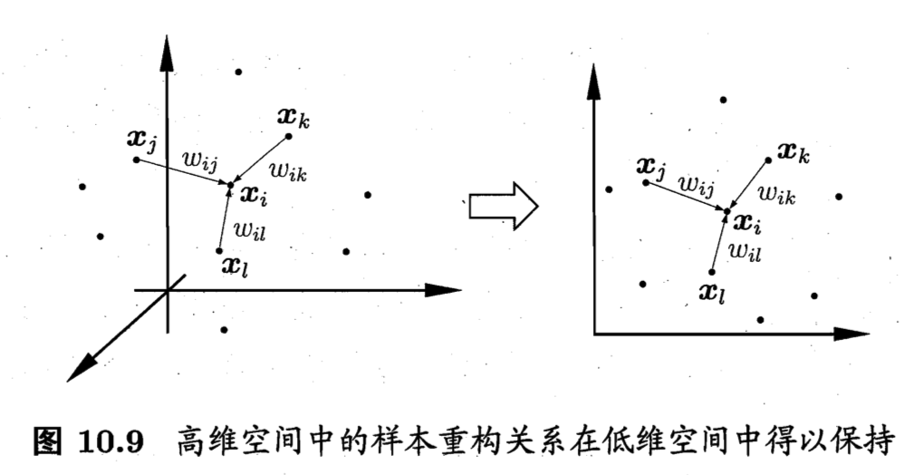

# 《机器学习公式详解》 （南瓜书）
## 第10章 降维和度量学习(下)
##### 异步社区
本节主讲：秦州

---
#### 本节大纲
##### 异步社区
南瓜书对应章节：10.5 10.6

1.流形学习
 - 等度量映射
 - 局部线性嵌入
 
2.度量学习

---
#### 流形学习(manifold learning)
##### 异步社区
“流形”：在局部具有欧式空间的性质。
虽然样本在高维空间中的分布看起来非常复杂，但是只要它们在局部上仍然具有欧式空间的性质，因此可以在局部建立降维映射关系，然后再设法将局部映射关系推广到全局。

---
#### 等度量映射(Isometric Mapping)
##### 异步社区
保持近邻样本之间的距离，因为测地线距离和高维空间的直线距离是不相等的

---
#### 等度量映射2
##### 异步社区
利用流形在局部上与欧式空间同胚的性质，找出每个点的欧式近邻，建立近邻的链接图，计算两个点之间的测地线距离转化为计算近邻链接图上两点之间的最短路径问题。

---
#### 等度量映射3
##### 异步社区
1.近邻图如何构建？
- $k$近邻图：指定$k$个点为近邻点  
- $\epsilon$近邻图：指定距离阈值$\epsilon$  
2. 对新样本如何变换
- 构建高维坐标和低维坐标的回归器

---
#### 局部线性嵌入(Locally Linear Embedding)
##### 异步社区
保持邻域内样本之间的线性关系。即假设样本点$\boldsymbol{x}_i$的坐标能通过它的邻域样本$\boldsymbol{x}_j,\boldsymbol{x}_k,\boldsymbol{x}_l$的坐标通过线性组合而重构得到：
$$
\boldsymbol{x}_{i}=w_{i j} \boldsymbol{x}_{j}+w_{i k} \boldsymbol{x}_{k}+w_{i l} \boldsymbol{x}_{l}
$$

---
#### 度量学习
##### 异步社区
每个空间其实对应了样本属性上定义的距离度量，寻找合适的空间的本质是寻找一个合适的距离度量。度量学习的基本动机是学习得到一个合理的“度量”。
之前我们介绍了很多计算距离的表达式（欧式距离等），但是“它们”都是固定的，没有可调节的参数，因此要先做一个推广。
欧式距离定义为
$$
\operatorname{dist}_{\mathrm{ed}}^{2}\left(\boldsymbol{x}_{i}, \boldsymbol{x}_{j}\right)=\left\|\boldsymbol{x}_{i}-\boldsymbol{x}_{j}\right\|_{2}^{2}=\operatorname{dist}_{i j, 1}^{2}+\operatorname{dist}_{i j, 2}^{2}+\ldots+\operatorname{dist}_{i j, d}^{2}
$$
假设不同属性的重要性不同，则可引入属性权重$w$
$$
\begin{aligned}
\operatorname{dist}_{\text {wed }}^{2}\left(\boldsymbol{x}_{i}, \boldsymbol{x}_{j}\right) &=\left\|\boldsymbol{x}_{i}-\boldsymbol{x}_{j}\right\|_{2}^{2}=w_{1} \cdot \operatorname{dist}_{i j, 1}^{2}+w_{2} \cdot \operatorname{dist}_{i j, 2}^{2}+\ldots+w_{d} \cdot d i s t_{i j, d}^{2} \\
&=\left(\boldsymbol{x}_{i}-\boldsymbol{x}_{j}\right)^{\mathrm{T}} \mathbf{W}\left(\boldsymbol{x}_{i}-\boldsymbol{x}_{j}\right)
\end{aligned}
$$

其中  $w_{i} \geqslant 0$, $\mathbf{W}=\operatorname{diag}(\boldsymbol{w})$是一个对角矩阵, $(\mathbf{W})_{i i}=w_{i}$

--- 
#### 度量学习2
##### 异步社区

通过以上方式，我们引入了变量$\mathbf{W}$，但是这样引入存在一个问题，因为$\mathbf{W}$的非对角线元素为0，因此坐标轴是正交的，意味着属性之间无关。为了更加符合实际，引入属性之间的关联性，可将$\mathbf{W}$替换成一个半正定对称矩阵$\mathbf{M}$，且$\mathbf{M}=\mathbf{P}^\mathbf{T}\mathbf{P}$，于是就得到了马氏距离
$$
\operatorname{dist}_{\operatorname{mah}}^{2}\left(\boldsymbol{x}_{i}, \boldsymbol{x}_{j}\right)=\left(\boldsymbol{x}_{i}-\boldsymbol{x}_{j}\right)^{\mathrm{T}} \mathbf{M}\left(\boldsymbol{x}_{i}-\boldsymbol{x}_{j}\right)
=\left(\mathbf{P}\left(\boldsymbol{x}_{i}-\boldsymbol{x}_{j}\right)\right)^{\mathrm{T}} \left(\mathbf{P}\left(\boldsymbol{x}_{i}-\boldsymbol{x}_{j}\right)\right)=\left\|\boldsymbol{x}_{i}-\boldsymbol{x}_{j}\right\|_{\mathbf{M}}^{2}
$$

如何学习$\mathbf{M}$？$\mathbf{M}$的学习与下游任务有关，比如如果我们希望提高近邻分类器的性能，则可将$\mathbf{M}$嵌入近邻分类器的评价指标里去，下面以近邻成分分析(Neighborhood Component Analysis) 为例解释这个过程。

---
#### 度量学习3 - NCA
##### 异步社区
前面介绍过得近邻算法（kNN）以邻居投票的形式决定自身的标签，假设将一邻一票替换成概率投票，即对于样本$\boldsymbol{x}_i$，他的邻居$\boldsymbol{x}_j$给他投票
$$
p_{i j}=\frac{\exp \left(-\left\|\boldsymbol{x}_{i}-\boldsymbol{x}_{j}\right\|_{\mathbf{M}}^{2}\right)}{\sum_{l} \exp \left(-\left\|\boldsymbol{x}_{i}-\boldsymbol{x}_{l}\right\|_{\mathbf{M}}^{2}\right)}
$$
那么样本$\boldsymbol{x}_i$被预测正确的概率为
$$
p_{i}=\sum_{j \in \Omega_{i}} p_{i j}
$$
其中$\Omega_{i}$表示和$\boldsymbol{x}_i$标签一致的样本集合（不包含$\boldsymbol{x}_i$自身）。

---
#### 度量学习 - NCA续
##### 异步社区
整个样本集上的错误率为
$$
\epsilon = 1 - \sum_{i=1}^{m} p_{i}=1- \sum_{i=1}^{m} \sum_{j \in \Omega_{i}} p_{i j}
$$
带入$p_{ij}$的计算公式，那么为了最小化分类错误率，有
$$
\min _{\mathbf{P}} 1-\sum_{i=1}^{m} \sum_{j \in \Omega_{i}} \frac{\exp \left(-\left\|\mathbf{P}^{\mathrm{T}} \boldsymbol{x}_{i}-\mathbf{P}^{\mathrm{T}} \boldsymbol{x}_{j}\right\|_{2}^{2}\right)}{\sum_{l} \exp \left(-\left\|\mathbf{P}^{\mathrm{T}} \boldsymbol{x}_{i}-\mathbf{P}^{\mathrm{T}} \boldsymbol{x}_{l}\right\|_{2}^{2}\right)}
$$

上式可以用随机梯度下降的方式求解。

---
#### 预告
##### 异步社区
下一节：特征选择和稀疏学习
特征选择
稀疏学习
西瓜书对应章节：第11章

---
#### 结束语
##### 异步社区

欢迎加入【南瓜书读者交流群】，我们将在群里进行答疑、勘误、本次直播回放、本次直播PPT发放、下次直播通知等最新资源发放和活动通知。
加入步骤：
1. 关注公众号【Datawhale】，发送【南瓜书】三个字获取机器人“小豚”的微信二维码
2. 添加“小豚”为微信好友，然后对“小豚”发送【南瓜书】三个字即可自动邀请进群

