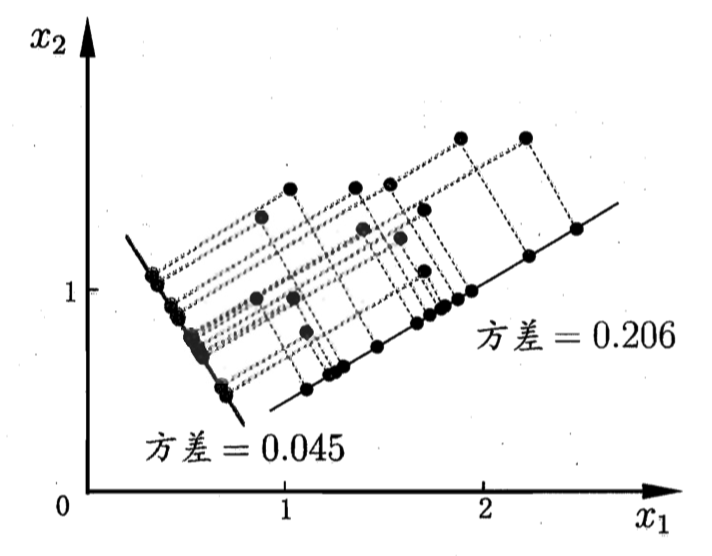

# 《机器学习公式详解》 （南瓜书）
## 第10章 降维和度量学习(上)
##### 异步社区
本节主讲：秦州

---
#### 本节大纲
##### 异步社区
南瓜书对应章节：10.1 10.2 10.3

1. k近邻学习
2. 低维嵌入
3. 主成分分析

---
#### k近邻学习(kNN)
##### 异步社区
kNN：**近朱者赤**。基于与待测样本最近的k个样本的信息进行预测。
1NN：最近邻分类器，待测样本标签和与之最近的样本标签一致。

给定测试样本$x$，若与之最近邻样本为$z$，则最近邻分类器出错的概率为
$$
P(e r r)=1-\sum_{c \in \mathcal{Y}} P(c \mid \boldsymbol{x}) P(c \mid \boldsymbol{z})
$$

---
#### k近邻学习(kNN)
##### 异步社区
令$c^{*}=\arg \max _{c \in \mathcal{Y}} P(c \mid \boldsymbol{x})$表示贝叶斯最优分类器结果，有
$$
\begin{aligned}
P(e r r) &=1-\sum_{c \in \mathcal{Y}} P(c \mid \boldsymbol{x}) P(c \mid \boldsymbol{z}) \\
& \simeq 1-\sum_{c \in \mathcal{Y}} P^{2}(c \mid \boldsymbol{x}) \\
& \leqslant 1-P^{2}\left(c^{*} \mid \boldsymbol{x}\right) \\
&=\left(1+P\left(c^{*} \mid \boldsymbol{x}\right)\right)\left(1-P\left(c^{*} \mid \boldsymbol{x}\right)\right) \\
& \leqslant 2 \times\left(1-P\left(c^{*} \mid \boldsymbol{x}\right)\right)
\end{aligned}
$$

**简单有效**：最近邻分类器的误差不超过贝叶斯最优分类器的误差的两倍！

---
#### 低维嵌入
##### 异步社区
**维度灾难**：样本稀疏而特征维数极高
**降维**：收集到的样本虽然是特征维数高，但与学习任务相关的可能仅仅是一个低维”嵌入“（embedding). 因此可以通过降维的手段提取重要的特征。一种度量方式是原始空间中的样本之间的距离在低维空间中仍然保持，对应本章的MDS算法。另一种简单方式是乘以一个低维的线性矩阵进行变换。
**线性降维方法**：给定 $d$ 维空间中的样本 $\mathbf{X}=\left(\boldsymbol{x}_{1}, \boldsymbol{x}_{2}, \ldots, \boldsymbol{x}_{m}\right) \in \mathbb{R}^{d \times m}$, 变换之后得到 $d^{\prime} \leqslant d$ 维 空间中的样本
$$
\mathbf{Z}=\mathbf{W}^{\mathrm{T}} \mathbf{X}
$$
其中 $\mathbf{W} \in \mathbb{R}^{d \times d^{\prime}}$ 是变换矩阵, $\mathbf{Z} \in \mathbb{R}^{d^{\prime} \times m}$ 是样本在新空间中的表达。

---
#### 主成分分析
<!-- ##### 异步社区 -->

**PCA** 主成分分析能够保证低维子空间对样本具有最大的可分性。
1. 样本点$\boldsymbol{x}_1$在新空间中超平面上的投影是$\boldsymbol{z}_i=\mathbf{W}^{\mathrm{T}}\boldsymbol{x}_i$
2. 从最大可分性出发，我们希望在新空间的每一维坐标轴上样本都尽可能分散（即每维特征尽可能分散）因此要求$\mathbf{Z}$各行方差最大

---
#### 主成分分析2
##### 异步社区

假设$\mathbf{Z}$的第$i$行记作$\mathbf{Z}_{i\cdot}$ 该行的均值记作$\bar{\boldsymbol{z}}$则
$$\sum^{d'}_{i=1}\frac{1}{m}\left(\mathbf{Z}_{i\cdot}-\bar{\boldsymbol{z}}\right)\left(\mathbf{Z}_{i\cdot}-\bar{\boldsymbol{z}}\right)^\mathrm{T}=\frac{1}{m}\sum^{d'}_{i=1}\mathbf{Z}_{i\cdot}\mathbf{Z}^\mathrm{T}_{i\cdot}=\frac{1}{m}\mathrm{tr}\left(\mathbf{Z}\mathbf{Z}^\mathrm{T}\right)
$$
根据之前定义的记号：$\mathbf{Z}=\mathbf{W}^{\mathrm{T}} \mathbf{X}$
忽略常数项，优化目标可写为
$$
\begin{array}{ll}
\max_{\mathbf{W}} & \operatorname{tr}\left(\mathbf{W}^{\mathrm{T}} \mathbf{X} \mathbf{X}^{\mathrm{T}} \mathbf{W}\right) \\\\
\text { s.t. } & \mathbf{W}^{\mathrm{T}} \mathbf{W}=\mathbf{I}
\end{array}
$$

---
#### 主成分分析-求解
##### 异步社区
使用拉格朗日乘子法，写出拉格朗日函数
$$
L(\mathbf{W}, \boldsymbol{\Lambda})=-\operatorname{tr}\left(\mathbf{W}^{\top} \mathbf{X X}^{\top} \mathbf{W}\right)+\left(\mathbf{W}^{\top} \mathbf{W}-\mathbf{I}\right) \boldsymbol{\Lambda}
$$
其中，
$$
\Lambda=\left[\begin{array}{cccc}
\lambda_{1} & & & \\
& \lambda_{2} & & \\
& & \ddots & \\
& & & \lambda_{d^{\prime}}
\end{array}\right] \in \mathbb{R}^{d^{\prime} \times d^{\prime}}, \mathbf{I}=\left[\begin{array}{cccc}
1 & & & \\
& 1 & & \\
& & \ddots & \\
& & & 1
\end{array}\right] \in \mathbb{R}^{d^{\prime} \times d^{\prime}}
$$

--- 
#### 主成分分析-求解2
##### 异步社区

对$\mathbf{W} \in \mathbb{R}^{d \times d^{\prime}}$求导：
$$
\begin{aligned}
\frac{\partial L(\mathbf{W}, \boldsymbol{\Lambda})}{\partial \mathbf{W}} &=-\frac{\partial \operatorname{tr}\left(\mathbf{W}^{\top} \mathbf{X} \mathbf{X}^{\top} \mathbf{W}\right)}{\partial \mathbf{W}}+\frac{\partial\left(\mathbf{W}^{\top} \mathbf{W}-\mathbf{I}\right)}{\partial \mathbf{W}} \boldsymbol{\Lambda} \\
&=-\mathbf{X X}^{\top} \mathbf{W}-\left(\mathbf{X X}^{\top}\right)^{\top} \mathbf{W}+2 \mathbf{W} \boldsymbol{\Lambda} \\
&=-2 \mathbf{X} \mathbf{X}^{\top} \mathbf{W}+2 \mathbf{W} \mathbf{\Lambda}
\end{aligned}
$$
另偏导$\frac{\partial L(\mathbf{W}, \boldsymbol{\Lambda})}{\partial \mathbf{W}}=0$，得：
$$
\mathbf{X X}^{\top} \mathbf{W}=\mathbf{W} \boldsymbol{\Lambda}
$$
或者将此式拆分成$d'$个式子：
$$
\mathbf{X X}^{\top} \boldsymbol{w}_{i}=\lambda_{i} \boldsymbol{w}_{i}, 1 \leqslant i \leqslant d
$$
即求矩阵$\mathbf{X X}^{\top} \in \mathbb{R}^{d \times d}$特征值和特征向量的形式。

---
#### 主成分分析-求解3
##### 异步社区
$\mathbf{X X}^{\top} \in \mathbb{R}^{d \times d}$有$d$个特征向量，但是我们只需要其中$d'$个，如何选择特征向量？
对 $\mathbf{X X}^{\top} \mathbf{W}=\mathbf{W} \boldsymbol{\Lambda}$ 两边同乘 $\mathbf{W}^{\top}$, 得
$$
\mathbf{W}^{\top} \mathbf{X X}^{\top} \mathbf{W}=\mathbf{W}^{\top} \mathbf{W} \mathbf{\Lambda}=\mathbf{\Lambda}
$$
我们的优化目标
$$
\operatorname{tr}\left(\mathbf{W}^{\top} \mathbf{X X}^{\top} \mathbf{W}\right)=\operatorname{tr}(\boldsymbol{\Lambda})=\sum_{i=1}^{d} \lambda_{i}
$$
因此最大化迹即选择最大的$d'$个$\lambda_i$，和它们所对应的$w_i$组成矩阵$\mathbf{W}$

---
#### 预告
##### 异步社区
下一节：降维和度量学习(下)
流形学习
度量学习
西瓜书对应章节：10.5 10.6

---
#### 结束语
##### 异步社区

欢迎加入【南瓜书读者交流群】，我们将在群里进行答疑、勘误、本次直播回放、本次直播PPT发放、下次直播通知等最新资源发放和活动通知。
加入步骤：
1. 关注公众号【Datawhale】，发送【南瓜书】三个字获取机器人“小豚”的微信二维码
2. 添加“小豚”为微信好友，然后对“小豚”发送【南瓜书】三个字即可自动邀请进群

