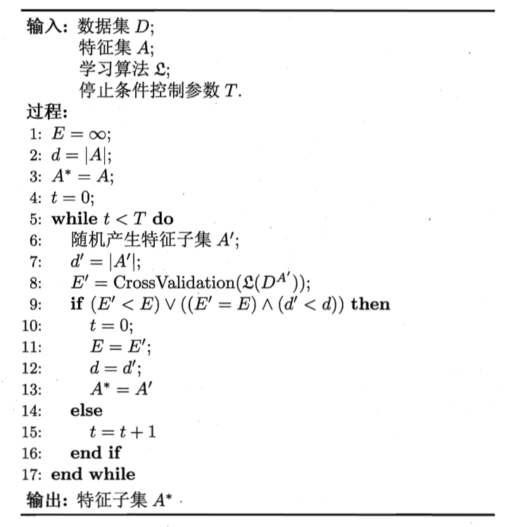
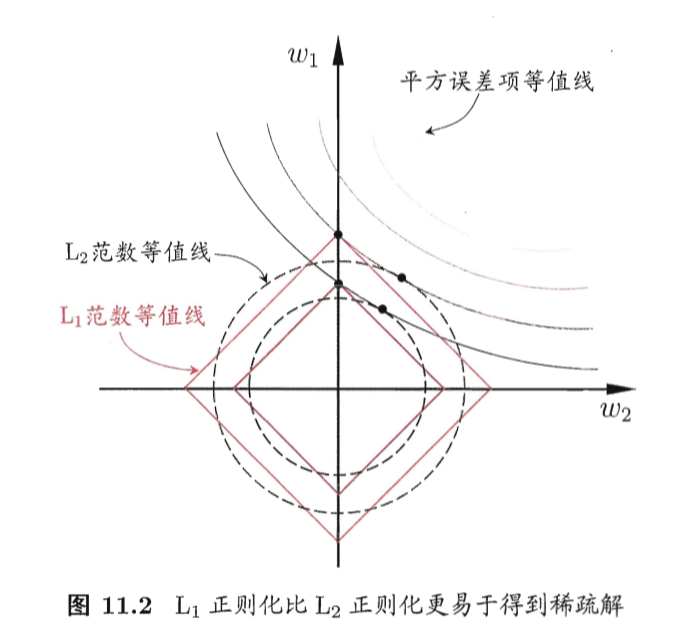

# 《机器学习公式详解》 （南瓜书）
## 第11章 特征选择和稀疏学习
##### 异步社区
本节主讲：秦州

---
#### 本节大纲
##### 异步社区
南瓜书对应章节：11.1, 11.2, 11.3, 11.4, 11.5

1. 子集搜索与评价
2. 正则与LASSO
3. 稀疏表示和字典学习

 

---
#### 特征选择
##### 异步社区
必要性：
1. 解决维数灾难的问题，和降维技术一起都是解决维数灾难的主流技术
2. 降低下游模型的学习难度

概念：
特征选择中所谓的“无关特征”是指与当前学习任务无关，所谓“冗余特征“是指该特征能够由其他特征推演得到。

基本做法：
产生一个候选子集 -> 评价好坏 -> 更新候选子集 -> 评价好坏 -> ... -> 最优子集

---
#### 特征选择-子集搜索
##### 异步社区
1. 前向搜索：给定特征集合 $\left\{a_{1}\right.$, $\left.a_{2}, \ldots, a_{d}\right\}$, 对这 $d$ 个候选单特征子集进行评价, 假定 $\left\{a_{2}\right\}$ 最优, 于是将 $\left\{a_{2}\right\}$ 作为第一轮的选定集; 然后, 在上一轮的选定集中加入一个特征, 构成包含两个特征的候选子集, 假定在这 $d-1$ 个候选两特征子集中 $\left\{a_{2}, a_{4}\right\}$ 最优, 且优于 $\left\{a_{2}\right\}$, 于是将 $\left\{a_{2}, a_{4}\right\}$ 作为本轮的选定集...... 假定在第 $k+1$ 轮时, 最优的候选 $(k+1)$ 特征子集不如上一轮的选定集, 则停止生成候选子集, 并将上一轮选定的 $k$ 特征集合作为特征选择结果.
2. 后向搜索：从完整子集开始，每次减少一个特征。
3. 双向搜索：在搜索过程中同时添加和减少特征。

---
#### 特征选择-子集评价
##### 异步社区
信息熵：
$$\operatorname{Ent}(D)=-\sum_{i=1}^{|\mathcal{Y}|} p_{k} \log _{2} p_{k}$$
其中给定数据集$D$，假设$D$中第$i$类样本所占比例为 $p_{i}(i=1,2, \ldots,|\mathcal{Y}|)$

信息增益：
$$\operatorname{Gain}(A)=\operatorname{Ent}(D)-\sum_{v=1}^{V} \frac{\left|D^{v}\right|}{|D|} \operatorname{Ent}\left(D^{v}\right)$$
其中对于属性子集$A$，假设根据其取值将$D$分成$V$个子集，记作 $\left\{D^{1}, D^{2}, \ldots, D^{V}\right\}$
信息增益越大，表示特征子集$A$包含的有助于分类的信息越多。

---
#### 特征选择-过滤式
##### 异步社区
先对数据集进行特征选择，再训练学习器，相当于用特征选择的算法对特征进行“过滤”。
**Relief算法** -- 给每一个特征计算一个“相关统计量”，通过该值来筛选特征
给定训练集 $\left\{\left(\boldsymbol{x}_{1}, y_{1}\right)\right.$, $\left.\left(\boldsymbol{x}_{2}, y_{2}\right), \ldots,\left(\boldsymbol{x}_{m}, y_{m}\right)\right\}$, 对每个示例 $\boldsymbol{x}_{i}$, Relief 先在 $\boldsymbol{x}_{i}$ 的同类样本中寻找其最近邻 $\boldsymbol{x}_{i, \mathrm{nh}}$, 称为 “猜中近邻” (near-hit), 再从 $\boldsymbol{x}_{i}$ 的异类样本中寻找其最近邻 $\boldsymbol{x}_{i, \mathrm{~nm}}$, 称为 “猜错近邻” (near-miss), 然后, 属性 $j$ 的相关统计量为：
$$
\delta^{j}=\sum_{i}\left(\operatorname{diff}\left(x_{i}^{j}, x_{i, \mathrm{~nm}}^{j}\right)^{2}-\operatorname{diff}\left(x_{i}^{j}, x_{i, \mathrm{nh}}^{j}\right)^{2}\right)
$$
即当属性$j$在异类样本中的差异大于同类样本，则属性$j$具有区分性。并且差异越明显，区分性越强。

---
#### 特征选择-包裹式
<!-- ##### 异步社区 -->
直接把最终将要使用的学习器作为特征子集的评价准则。
**LVW（Las Vegas Wrapper）算法**

---
#### 特征选择-嵌入式
##### 异步社区
将特征选择的过程和学习器的训练过程融合起来。即在学习器训练的过程中自动进行了特征选择。
给定数据集 $D=\left\{\left(\boldsymbol{x}_{1}, y_{1}\right),\left(\boldsymbol{x}_{2}, y_{2}\right), \ldots,\left(\boldsymbol{x}_{m}, y_{m}\right)\right\}$, 其中 $\boldsymbol{x} \in \mathbb{R}^{d}, y \in \mathbb{R}$. 我 们考虑最简单的线性回归模型, 以平方误差为损失函数, 则优化目标为
$$
\min _{\boldsymbol{w}} \sum_{i=1}^{m}\left(y_{i}-\boldsymbol{w}^{\mathrm{T}} \boldsymbol{x}_{i}\right)^{2}
$$
为了降低模型过拟合的风险，我们可以对$\boldsymbol{w}$加一个限制，即在优化目标中加上带有$\boldsymbol{w}$的项，比如
$$\min _{\boldsymbol{w}} \sum_{i=1}^{m}\left(y_{i}-\boldsymbol{w}^{\mathrm{T}} \boldsymbol{x}_{i}\right)^{2}+\lambda\|\boldsymbol{w}\|_{2}^{2}$$
增加了$\boldsymbol{w}$的$\mathrm{L}_2$的正规化项也称为岭回归。

---
#### 特征选择-嵌入式
<!-- ##### 异步社区 -->

$\mathrm{L}_1$范数更容易得到稀疏解，达到特征选择的目的。
$$\min _{\boldsymbol{x}} f(\boldsymbol{x})+\lambda\|\boldsymbol{x}\|_{1}$$
基于L1正则化的学习方法就是一种嵌入式特征选择方法，其特征选择过程域学习器训练过程融为一体，同时完成。
这个函数的形式又称为LASSO。

---
#### 稀疏表示和字典学习
##### 异步社区
稀疏性：如果数据集$D$是一个矩阵，每行对应于一个样本，每列对应于一维特征，特征选择解决的是矩阵中的列与任务无关，因此可以安全地去除。
另一种稀疏性是指数据集中存在许多0元素，但是他们不是整列排布的。稀疏性会带来一些好处，比如文本数据使用字频表示后具有高度的稀疏性，从而变得线性可分。
将稠密数据变得稀疏是否有好的方法？显然，对于一般的任务没有这样的“字典”，因此我们要学习得到一个合适的“字典”，使学习任务得以简化。这种技术就叫做“字典学习”（dictionary learning），也称作“稀疏编码”（sparse coding）。字典学习更加偏重于得到字典的过程，而稀疏编码偏重于得到字典后对样本进行稀疏转换。

---

#### 字典学习
##### 异步社区
给定数据集$\left\{\boldsymbol{x}_{1}, \boldsymbol{x}_{2}, \ldots, \boldsymbol{x}_{m}\right\}$，字典学习最简单的形式为

$$\min _{\mathbf{B}, \boldsymbol{\alpha}_{i}} \sum_{i=1}^{m}\left\|\boldsymbol{x}_{i}-\mathbf{B} \boldsymbol{\alpha}_{i}\right\|_{2}^{2}+\lambda \sum_{i=1}^{m}\left\|\boldsymbol{\alpha}_{i}\right\|_{1}$$

其中 $\mathbf{B} \in \mathbb{R}^{d \times k}$ 为字典矩阵, $k$ 称为字典的词汇量, 通常由用户指定, $\boldsymbol{\alpha}_{i} \in \mathbb{R}^{k}$ 则是样本 $\boldsymbol{x}_{i} \in \mathbb{R}^{d}$ 的稀疏表示. 显然, 该式的第一项是希望由 $\boldsymbol{\alpha}_{i}$ 能很好地重构 $\boldsymbol{x}_{i}$, 第二项则是希望 $\boldsymbol{\alpha}_{i}$ 尽量稀疏。

---

#### 字典学习-求解方法
##### 异步社区
有两个变量$\boldsymbol{\alpha}$ 和 $\mathbf{B}$，因此我们采用变量交替优化的策略求解。
第一步：固定字典$\mathbf{B}$求解$\boldsymbol{\alpha}_i$，则优化形式为
$$\min _{\boldsymbol{\alpha}_{i}} \sum_{i=1}^{m}\left\|\boldsymbol{x}_{i}-\mathbf{B} \boldsymbol{\alpha}_{i}\right\|_{2}^{2}+\lambda \sum_{i=1}^{m}\left\|\boldsymbol{\alpha}_{i}\right\|_{1}$$
可以采用LASSO的方式优化
第二步：固定$\boldsymbol{\alpha}_{i}$求解$\mathbf{B}$，则优化形式为
$$\min _{\mathbf{B}} \sum_{i=1}^{m}\left\|\boldsymbol{x}_{i}-\mathbf{B} \boldsymbol{\alpha}_{i}\right\|_{2}^{2}=\min _{\mathbf{B}}\|\mathbf{X}-\mathbf{B} \mathbf{A}\|_{F}^{2}$$
其中 $\mathbf{X}=\left(\boldsymbol{x}_{1}, \boldsymbol{x}_{2}, \ldots, \boldsymbol{x}_{m}\right) \in \mathbb{R}^{d \times m}, \mathbf{A}=\left(\boldsymbol{\alpha}_{1}, \boldsymbol{\alpha}_{2}, \ldots, \boldsymbol{\alpha}_{m}\right) \in \mathbb{R}^{k \times m},\|\cdot\|_{F}$ 是 矩阵的 Frobenius 范数。

---

#### 字典学习-求解方法续
##### 异步社区

$\begin{aligned} \min _{\mathbf{B}}\|\mathbf{X}-\mathbf{B} \mathbf{A}\|_{F}^{2} &=\min _{\boldsymbol{b}_{i}}\left\|\mathbf{X}-\sum_{j=1}^{k} \boldsymbol{b}_{j} \boldsymbol{\alpha}^{j}\right\|_{F}^{2} \\ &=\min _{\boldsymbol{b}_{i}}\left\|\left(\mathbf{X}-\sum_{j \neq i} \boldsymbol{b}_{j} \boldsymbol{\alpha}^{j}\right)-\boldsymbol{b}_{i} \boldsymbol{\alpha}^{i}\right\|^{2} \\ &=\min _{\boldsymbol{b}_{i}}\left\|\mathbf{E}_{i}-\boldsymbol{b}_{i} \boldsymbol{\alpha}^{i}\right\|_{F}^{2} \end{aligned}$
注意到更新$\boldsymbol{b}_i$时$\boldsymbol{b}_j$是固定的，因此$\mathbf{E}_i$也是一个常数。因此优化式表示的是一个$\mathbf{E}_i$的低秩矩阵近似，即求解$\mathbf{E}_i$的最优1秩近似矩阵$\boldsymbol{b}_i\boldsymbol{\alpha}^i$。

---
#### 预告
##### 异步社区
下一节：计算学习理论

西瓜书对应章节：第12章

---
#### 结束语
##### 异步社区

欢迎加入【南瓜书读者交流群】，我们将在群里进行答疑、勘误、本次直播回放、本次直播PPT发放、下次直播通知等最新资源发放和活动通知。
加入步骤：
1. 关注公众号【Datawhale】，发送【南瓜书】三个字获取机器人“小豚”的微信二维码
2. 添加“小豚”为微信好友，然后对“小豚”发送【南瓜书】三个字即可自动邀请进群

