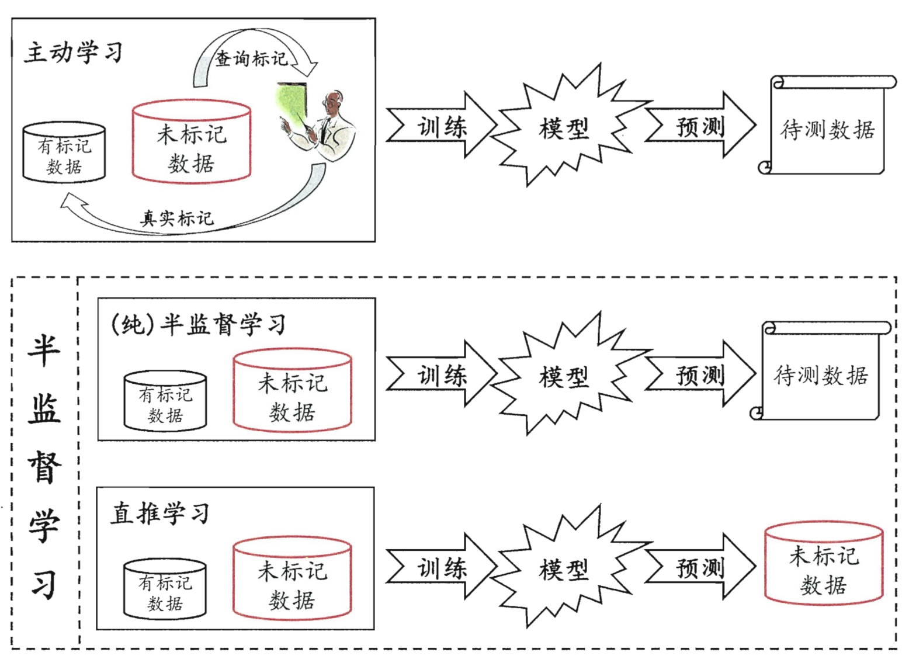
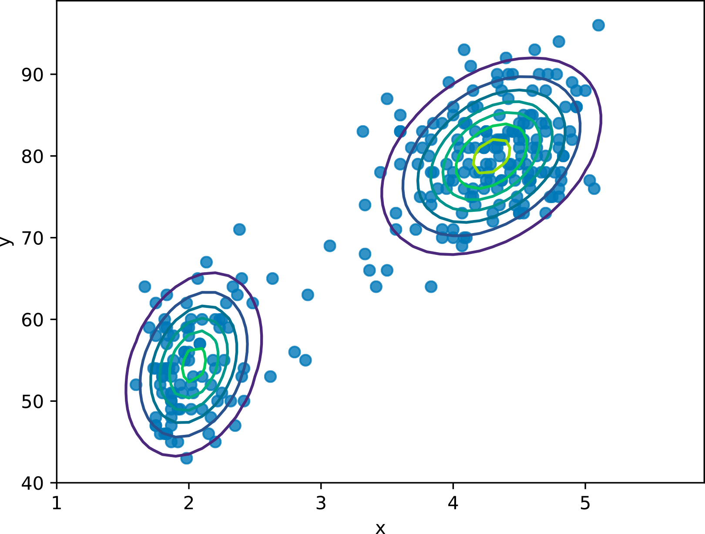
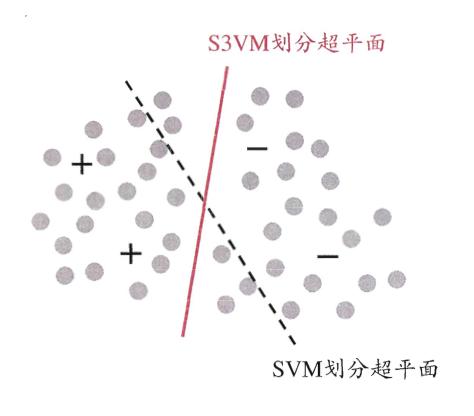
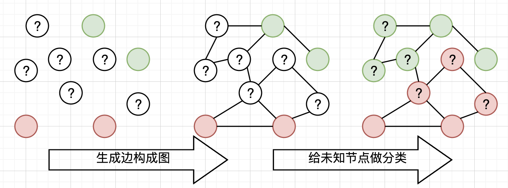

# 《机器学习公式详解》 （南瓜书）
## 第13章 半监督学习
##### 异步社区
本节主讲：秦州

---

#### 本节大纲
##### 异步社区
南瓜书对应章节：第13.1节, 13.2节, 13.3节, 13.4节

1. 半监督学习的定义
2. 半监督学习的主要方法
3. 图半监督学习的推导
4. 总结

---

#### 监督学习解决现实问题有哪些难点？
##### 异步社区
1. **标记数据获取成本高**：在许多领域如医疗，获取标记数据是昂贵且耗时的。
2. **未标记数据大量存在且易得**：相对而言，未标记数据大量存在且容易获取。
3. **提升模型的泛化能力**：通过利用未标记数据，可以增强模型的泛化能力。

举例：在医疗领域，获取医生标记的诊断数据非常昂贵，但有大量未标记的病人记录。半监督学习可以帮助利用这些未标记数据，提高疾病预测模型的准确性。

---
#### 什么是半监督学习？
##### 异步社区
半监督学习结合了有监督学习和无监督学习，半监督学习使用少量的标记数据（如 $D_l$）和大量的未标记数据（如 $D_u$）来训练模型，主要目标是提升模型在未标记数据上的表现。

---

#### 半监督学习的典型方法
##### 异步社区

1. 基于生成模型的方法（generative method）
2. 半监督SVM（semi-supervised SVM)
3. 图半监督学习（Graph-based Semi-supervised Learning）

---

#### 基于生成模型的方法
##### 异步社区

- 假设所有数据(无论是否有标记)都是由一个潜在的模型 “生成” 的。那么无标记的数据可以帮助更准确的估计潜在模型的参数。
- 比如右图中可以看到数据可以由两个高斯分布近似，则无监督的数据可以被用来更好得做高斯分布的参数估计。

---

#### 半监督SVM
##### 异步社区

- 在不考虑未标记样本时, 支持向量机试图找到最大间隔划分超平面
- 而在考虑未标记样本后, 半监督SVM试图找到能将两类有标记样本分开, 且穿过数据低密度区域的划分超平面

---

#### 图半监督学习
##### 异步社区

利用无标签数据和标签数据的特征相似性将数据构成图，然后再图上进行节点分类。

---

#### 图半监督学习方法详解
##### 异步社区

给定 $D_{l}=\left\{\left(\boldsymbol{x}_{1}, y_{1}\right),\left(\boldsymbol{x}_{2}, y_{2}\right), \ldots,\left(\boldsymbol{x}_{l}, y_{l}\right)\right\}$ 和 $D_{u}=\left\{\boldsymbol{x}_{l+1}, \boldsymbol{x}_{l+2}, \ldots, \boldsymbol{x}_{l+u}\right\}$. 我们基于 $D_{l} \cup D_{u}$ 构建一个图 $G=(V, E)$, 其中结点集 $V=\left\{\boldsymbol{x}_{1}, \ldots, \boldsymbol{x}_{l}, \boldsymbol{x}_{l+1}, \ldots, \boldsymbol{x}_{l+u}\right\}$, 边集 $E$ 可表示为一个亲和矩阵 (affinity matrix), 常基于高斯函数定义为

$$
(\mathbf{W})_{i j}= \begin{cases}\exp \left(\frac{-\left\|\boldsymbol{x}_{i}-\boldsymbol{x}_{j}\right\|_{2}^{2}}{2 \sigma^{2}}\right), & \text { if } i \neq j \\ 0, & \text { otherwise }\end{cases}
$$

假定$f\left(\boldsymbol{x}_{i}\right)$是分类模型的输出类别标记. 直观上看, 相似的样本应具有相似的标记,于是可定义关于 $f$ 的 “能量函数” (energy function) ：

$$
\begin{align*}
E(f) & =\frac{1}{2} \sum_{i=1}^{m} \sum_{j=1}^{m}(\mathbf{W})_{i j}\left(f\left(\boldsymbol{x}_{i}\right)-f\left(\boldsymbol{x}_{j}\right)\right)^{2}
\end{align*}
$$

---

#### 图半监督学习方法推导1
##### 异步社区
$$
\begin{aligned}
E(f) &=\frac{1}{2} \sum_{i=1}^{m} \sum_{j=1}^{m}(\mathbf{W})_{i j}\left(f\left(\boldsymbol{x}_{i}\right)-f\left(\boldsymbol{x}_{j}\right)\right)^{2} 
=\frac{1}{2} \sum_{i=1}^{m} \sum_{j=1}^{m}(\mathbf{W})_{i j}\left(f^{2}\left(\boldsymbol{x}_{i}\right)-2 f\left(\boldsymbol{x}_{i}\right) f\left(\boldsymbol{x}_{j}\right)+f^{2}\left(\boldsymbol{x}_{j}\right)\right) \\
&=\frac{1}{2}\left( \sum_{i=1}^{m} \sum_{j=1}^{m}(\mathbf{W})_{i j} f^{2}\left(\boldsymbol{x}_{i}\right)+ \sum_{i=1}^{m} \sum_{j=1}^{m}(\mathbf{W})_{i j} f^{2}\left(\boldsymbol{x}_{j}\right)-2\sum_{i=1}^{m} \sum_{j=1}^{m}(\mathbf{W})_{i j} f\left(\boldsymbol{x}_{i}\right) f\left(\boldsymbol{x}_{j}\right)\right)
\end{aligned}
$$
由于$\mathbf{W}$是一个对称矩阵，可以通过变量替换得到
$$
\begin{aligned}
\sum_{i=1}^{m} \sum_{j=1}^{m}(\mathbf{W})_{i j} f^{2}\left(\boldsymbol{x}_{j}\right)&=\sum_{j=1}^{m} \sum_{i=1}^{m}(\mathbf{W})_{j i} f^{2}\left(\boldsymbol{x}_{i}\right)\\
&=\sum_{i=1}^{m} \sum_{j=1}^{m}(\mathbf{W})_{i j} f^{2}\left(\boldsymbol{x}_{i}\right)\\
&=
\sum_{i=1}^{m} \sum_{j=1}^{m}(\mathbf{W})_{i j} f^{2}\left(\boldsymbol{x}_{j}\right)
\end{aligned}
$$

---

#### 图半监督学习方法推导2
##### 异步社区

因此$E(f)$可化简为
$$
\begin{aligned}
E(f) &=  \sum_{i=1}^{m} \sum_{j=1}^{m}(\mathbf{W})_{i j} f^{2}\left(\boldsymbol{x}_{i}\right)-\sum_{i=1}^{m} \sum_{j=1}^{m}(\mathbf{W})_{i j} f\left(\boldsymbol{x}_{i}\right) f\left(\boldsymbol{x}_{j}\right)
\end{aligned}
$$
根据定义 $d_i=\sum_{j=1}^{l+u}\left(\mathbf{W}\right)_{ij}$，且$m=l+u$则
$$
\begin{aligned}
E(f)&=\sum_{i=1}^{m} d_{i} f^{2}\left(\boldsymbol{x}_{i}\right)-\sum_{i=1}^{m} \sum_{j=1}^{m}(\mathbf{W})_{i j} f\left(\boldsymbol{x}_{i}\right) f\left(\boldsymbol{x}_{j}\right)\\
&=\boldsymbol{f}^{\mathrm{T}}\mathbf{D}\boldsymbol{f}-\boldsymbol{f}^{\mathrm{T}}\mathbf{W}\boldsymbol{f}\\
&=\boldsymbol{f}^{\mathrm{T}}(\mathbf{D}-\mathbf{W}) \boldsymbol{f}
\end{aligned}
$$

---

#### 图半监督学习方法推导3
##### 异步社区

以第 $l$ 行与第 $l$ 列为界, 采用分块矩阵表示: $\mathbf{W}=\left[\begin{array}{cc}\mathbf{W}_{l l} & \mathbf{W}_{l u} \\ \mathbf{W}_{u l} & \mathbf{W}_{u u}\end{array}\right],\mathbf{D}=\left[\begin{array}{cc}\mathbf{D}_{l l} & \mathbf{0}_{l u} \\ \mathbf{0}_{u l} & \mathbf{D}_{u u}\end{array}\right]$
则

$$
\begin{aligned}
E(f) &=\left(\boldsymbol{f}_{l}^{\mathrm{T}} \boldsymbol{f}_{u}^{\mathrm{T}}\right)\left(\left[\begin{array}{ll}
\mathbf{D}_{l l} & \mathbf{0}_{l u} \\
\mathbf{0}_{u l} & \mathbf{D}_{u u}
\end{array}\right]-\left[\begin{array}{ll}
\mathbf{W}_{l l} & \mathbf{W}_{l u} \\
\mathbf{W}_{u l} & \mathbf{W}_{u u}
\end{array}\right]\right)\left[\begin{array}{l}
\boldsymbol{f}_{l} \\
\boldsymbol{f}_{u}
\end{array}\right] \\
&=\boldsymbol{f}_{l}^{\mathrm{T}}\left(\mathbf{D}_{l l}-\mathbf{W}_{l l}\right) \boldsymbol{f}_{l}-2 \boldsymbol{f}_{u}^{\mathrm{T}} \mathbf{W}_{u l} \boldsymbol{f}_{l}+\boldsymbol{f}_{u}^{\mathrm{T}}\left(\mathbf{D}_{u u}-\mathbf{W}_{u u}\right) \boldsymbol{f}_{u}
\end{aligned}
$$

对$\boldsymbol{f}_{u}$求偏微分

$$
\begin{aligned}
\frac{\partial E(f)}{\partial \boldsymbol{f}_{u}} &=-2 \boldsymbol{W}_{u l} \boldsymbol{f}_{l}+2\left(\boldsymbol{D}_{u u}-\boldsymbol{W}_{u u}\right) \boldsymbol{f}_{u}
\end{aligned}
$$

令结果为0得到：
$$
\boldsymbol{f}_{u}=\left(\mathbf{D}_{u u}-\mathbf{W}_{u u}\right)^{-1} \mathbf{W}_{u l} \boldsymbol{f}_{l}
$$

---

#### 总结
##### 异步社区
1. 半监督学习的重要性：在标记数据稀缺时，能有效提升模型性能。
2. 半监督学习的挑战
  a. **模型假设的准确性**：错误的模型假设可能导致性能下降。
  b. **多个低密度划分问题**：训练数据中存在多个低密度划分，算法可能做出不利选择。
  c. **安全性问题**：如何确保模型在利用未标记数据时不会受到负面影响。
3. 未来的发展方向：结合主动学习、多视图学习等技术，进一步提升半监督学习的效果。

---

#### 结束语
##### 异步社区

欢迎加入【南瓜书读者交流群】，我们将在群里进行答疑、勘误、本次直播回放、本次直播PPT发放、下次直播通知等最新资源发放和活动通知。
加入步骤：
1. 关注公众号【Datawhale】，发送【南瓜书】三个字获取机器人“小豚”的微信二维码
2. 添加“小豚”为微信好友，然后对“小豚”发送【南瓜书】三个字即可自动邀请进群

