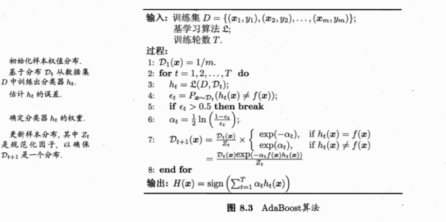

# 《机器学习公式详解》 （南瓜书）
## 第8章 集成学习
##### 异步社区
本节主讲：秦州

---
#### 本节大纲
##### 异步社区
西瓜书对应章节：8.1、8.2
1. 个体与集成
2. Adaboost算法
---
#### 个体与集成
##### 异步社区

“三个臭皮匠，顶个诸葛亮”，集成学习通过集合 **多个个体学习器** 的结果来提升预测结果的准确性和泛化能力。

“君子和而不同” 个体学习器需要比随机猜想要强一些，个体学习器的预测结果也要具有一定的多样性。

|          | 样本a | 样本b | 样本c |   | 样本a | 样本b | 样本c |   | 样本a | 样本b | 样本c |
|----------|-------|-------|-------|---|-------|-------|-------|---|-------|-------|-------|
| 学习器1  | 1     | 1     | 0     |   | 1     | 0     | 0     |   | 1     | 1     | 0     |
| 学习器2  | 1     | 0     | 1     |   | 0     | 1     | 0     |   | 1     | 1     | 0     |
| 学习器3  | 0     | 1     | 1     |   | 0     | 0     | 1     |   | 1     | 1     | 0     |
| 集成结果 | 1     | 1     | 1     |   | 0     | 0     | 0     |   | 1     | 1     | 0     |

---
#### 个体与集成
##### 异步社区
集成个体学习器的收敛性保证：

$$
\begin{aligned}
P(H(\boldsymbol{x}) \neq f(\boldsymbol{x})) &=\sum_{k=0}^{\lfloor T / 2\rfloor}\left(\begin{array}{l}
T \\
k
\end{array}\right)(1-\epsilon)^{k} \epsilon^{T-k} \\
& \leqslant \exp \left(-\frac{1}{2} T(1-2 \epsilon)^{2}\right)
\end{aligned}
$$
两个基本结论：
- 收敛速率随着个体学习器数量T呈指数下降
- $\epsilon= 0.5$的个体集成器对收敛没有作用

---
#### Adaboost算法1
##### 异步社区
学习$T$个个体学习器$h_t$和相应的权重$\alpha_t$，使得他们的加权和
$$
H(\boldsymbol{x})=\sum^T_{t=1}\alpha_th_t(\boldsymbol{x})
$$
能够最小化损失函数
$$
\ell_{\exp }(H \mid \mathcal{D})=\mathbb{E}_{\boldsymbol{x} \sim \mathcal{D}}\left[e^{-f(\boldsymbol{x}) H(\boldsymbol{x})}\right]
$$

---
#### Adaboost算法2
##### 异步社区
**前向分布求解算法：** 每一轮只学习一个学习器$h_t$和相应的权重$\alpha_t$，第$t$轮的优化目标
$$
\left(\alpha_{t}, h_{t}\right)=\underset{\alpha, h}{\arg \min } \ell_{\exp }\left(H_{t-1}+\alpha h \mid \mathcal{D}\right)
$$
根据指数损失函数的定义式(8.5)，有
$$
\begin{aligned}
\ell_{\exp }\left(H_{t-1}+\alpha h \mid \mathcal{D}\right) &=\mathbb{E}_{\boldsymbol{x} \sim \mathcal{D}}\left[e^{-f(\boldsymbol{x})\left(H_{t-1}(\boldsymbol{x})+\alpha h(\boldsymbol{x})\right)}\right] \\
&=\sum_{i=1}^{|D|} \mathcal{D}\left(\boldsymbol{x}_{i}\right) e^{-f\left(\boldsymbol{x}_{i}\right)\left(H_{t-1}\left(\boldsymbol{x}_{i}\right)+\alpha h\left(\boldsymbol{x}_{i}\right)\right)} \\
&=\sum_{i=1}^{|D|} \mathcal{D}\left(\boldsymbol{x}_{i}\right) e^{-f\left(\boldsymbol{x}_{i}\right) H_{t-1}\left(\boldsymbol{x}_{i}\right)} e^{-f\left(\boldsymbol{x}_{i}\right) \alpha h\left(\boldsymbol{x}_{i}\right)} 
\end{aligned}
$$

---
#### Adaboost算法3
##### 异步社区
因为$f(x_i)$和$h(x_i)$仅可取值$\{-1, 1\}$，可以推得
$$
\begin{aligned}
\ell_{\exp }\left(H_{t-1}+\alpha h \mid \mathcal{D}\right) &=\sum_{i=1}^{|D|} \mathcal{D}\left(\boldsymbol{x}_{i}\right) e^{-f\left(\boldsymbol{x}_{i}\right) H_{t-1}\left(\boldsymbol{x}_{i}\right)}\left(e^{-\alpha}+\left(e^{\alpha}-e^{-\alpha}\right) \mathbb{I}\left(f\left(\boldsymbol{x}_{i}\right) \neq h\left(\boldsymbol{x}_{i}\right)\right)\right) \\
&=\sum_{i=1}^{|D|} \mathcal{D}\left(\boldsymbol{x}_{i}\right) e^{-f\left(\boldsymbol{x}_{i}\right) H_{t-1}\left(\boldsymbol{x}_{i}\right)} e^{-\alpha}+\sum_{i=1}^{|D|} \mathcal{D}\left(\boldsymbol{x}_{i}\right) e^{-f\left(\boldsymbol{x}_{i}\right) H_{t-1}\left(\boldsymbol{x}_{i}\right)}\left(e^{\alpha}-e^{-\alpha}\right) \mathbb{I}\left(f\left(\boldsymbol{x}_{i}\right) \neq h\left(\boldsymbol{x}_{i}\right)\right) 
\end{aligned}
$$
做一个简单的符号替换，令$\mathcal{D}_{t}^\prime\left(\boldsymbol{x}_{i}\right)=\mathcal{D}\left(\boldsymbol{x}_{i}\right) e^{-f\left(\boldsymbol{x}_{i}\right) H_{t-1}\left(\boldsymbol{x}_{i}\right)}$，并且注意到$e^{-\alpha}$和$e^\alpha-e^{-\alpha}$与求和变量$i$无关，可以提取出来，有
$$
\begin{aligned}
\ell_{\exp }\left(H_{t-1}+\alpha h \mid \mathcal{D}\right) &= e^{-\alpha} \sum_{i=1}^{|D|} \mathcal{D}_{t}^\prime\left(\boldsymbol{x}_{i}\right)+\left(e^{\alpha}-e^{-\alpha}\right) \sum_{i=1}^{|D|} \mathcal{D}_{t}^\prime\left(\boldsymbol{x}_{i}\right) \mathbb{I}\left(f\left(\boldsymbol{x}_{i}\right) \neq h\left(\boldsymbol{x}_{i}\right)\right)
\end{aligned}
$$

---
#### Adaboost算法4
##### 异步社区
$$
\begin{aligned}
\ell_{\exp }\left(H_{t-1}+\alpha h \mid \mathcal{D}\right) &= e^{-\alpha} \sum_{i=1}^{|D|} \mathcal{D}_{t}^\prime\left(\boldsymbol{x}_{i}\right)+\left(e^{\alpha}-e^{-\alpha}\right) \sum_{i=1}^{|D|} \mathcal{D}_{t}^\prime\left(\boldsymbol{x}_{i}\right) \mathbb{I}\left(f\left(\boldsymbol{x}_{i}\right) \neq h\left(\boldsymbol{x}_{i}\right)\right)
\end{aligned}
$$
我们的目的是求解$h_t$使得$\ell_{\exp}$最小化，因此可以忽略掉与$h$无关的项，即求解目标是
$$
h_{t}=\underset{h}{\arg \min }\left(e^{\alpha}-e^{-\alpha}\right) \sum_{i=1}^{|D|} \mathcal{D}_{t}^\prime\left(\boldsymbol{x}_{i}\right) \mathbb{I}\left(f\left(\boldsymbol{x}_{i}\right) \neq h\left(\boldsymbol{x}_{i}\right)\right)
$$
更近一步，由于$\alpha>\frac{1}{2}$，易证得$e^\alpha-e^{-\alpha}>0$恒成立，因此求解目标为：
$$
h_{t}=\underset{h}{\arg \min } \sum_{i=1}^{|D|} \mathcal{D}_{t}^\prime\left(\boldsymbol{x}_{i}\right) \mathbb{I}\left(f\left(\boldsymbol{x}_{i}\right) \neq h\left(\boldsymbol{x}_{i}\right)\right)
$$

---
#### Adaboost算法5
##### 异步社区
$$
h_{t}=\underset{h}{\arg \min } \sum_{i=1}^{|D|} \mathcal{D}_{t}^\prime\left(\boldsymbol{x}_{i}\right) \mathbb{I}\left(f\left(\boldsymbol{x}_{i}\right) \neq h\left(\boldsymbol{x}_{i}\right)\right)
$$
其中 $\mathcal{D}_{t}^\prime\left(\boldsymbol{x}_{i}\right)=\mathcal{D}\left(\boldsymbol{x}_{i}\right) e^{-f\left(\boldsymbol{x}_{i}\right) H_{t-1}\left(\boldsymbol{x}_{i}\right)}$
观察$\mathcal{D}_t^\prime\left(\boldsymbol{x}_{i}\right)$的形式可以发现它仅与$t-1$轮及以前的学习器有关，因此在求解$h_t$时，对于每个样本$i$，他其实已经固定了，如果把$\mathcal{D}_t^\prime\left(\boldsymbol{x}_{i}\right)$看做样本$i$在$t$轮学习时的权重分布，我们要依据这个权重求解学习器$h_t$以满足上面的最优化式子。
同时，为了确保$\mathcal{D}_t^\prime\left(\boldsymbol{x}_{i}\right)$是一个分布，通常我们对其进行规范化后作为下一个学习器的输入样本权重，即$\mathcal{D}_t\left(\boldsymbol{x}_{i}\right)=\frac{\mathcal{D}_t^\prime\left(\boldsymbol{x}_{i}\right)}{\sum^{|D|}_{i=1}\mathcal{D}_t^\prime\left(\boldsymbol{x}_{i}\right)}$，其中分母是常数，因此这个变换不会影响上述最小化的求解。

---
#### Adaboost算法6
##### 异步社区
有意思的一点是，$t$轮的样本权重可以通过$t-1$轮样本权重计算，而无需从头算起，以$t+1$轮为例，根据迭代公式，有：
$$
\begin{aligned}
\mathcal{D}_{t+1}\left(\boldsymbol{x}_{i}\right) &=\mathcal{D}\left(\boldsymbol{x}_{i}\right) e^{-f\left(\boldsymbol{x}_{i}\right) H_{t}\left(\boldsymbol{x}_{i}\right)} \\
&=\mathcal{D}\left(\boldsymbol{x}_{i}\right) e^{-f\left(\boldsymbol{x}_{i}\right)\left(H_{t-1}\left(\boldsymbol{x}_{i}\right)+\alpha_{t} h_{t}\left(\boldsymbol{x}_{i}\right)\right)} \\
&=\mathcal{D}\left(\boldsymbol{x}_{i}\right) e^{-f\left(\boldsymbol{x}_{i}\right) H_{t-1}\left(\boldsymbol{x}_{i}\right)} e^{-f\left(\boldsymbol{x}_{i}\right) \alpha_{t} h_{t}\left(\boldsymbol{x}_{i}\right)} \\
&=\mathcal{D}_{t}\left(\boldsymbol{x}_{i}\right) e^{-f\left(\boldsymbol{x}_{i}\right) \alpha_{t} h_{t}\left(\boldsymbol{x}_{i}\right)}
\end{aligned}
$$
这便是《机器学习》式8.19

---
#### Adaboost算法7
##### 异步社区
下面求解学习器$h_t$的权重$\alpha_t$。损失函数$\ell_{\exp }\left(H_{t-1}+\alpha h \mid \mathcal{D}\right)$对$\alpha$求导有：
$$
\begin{aligned}
\frac{\partial \ell_{\exp }\left(H_{t-1}+\alpha h_{t} \mid \mathcal{D}\right)}{\partial \alpha} &=\frac{\partial\left(e^{-\alpha} \sum_{i=1}^{|D|} \mathcal{D}_{t}^{\prime}\left(\boldsymbol{x}_{i}\right)+\left(e^{\alpha}-e^{-\alpha}\right) \sum_{i=1}^{|D|} \mathcal{D}_{t}^{\prime}\left(\boldsymbol{x}_{i}\right) \mathbb{I}\left(f\left(\boldsymbol{x}_{i}\right) \neq h\left(\boldsymbol{x}_{i}\right)\right)\right)}{\partial \alpha} \\
&=-e^{-\alpha} \sum_{i=1}^{|D|} \mathcal{D}_{t}^{\prime}\left(\boldsymbol{x}_{i}\right)+\left(e^{\alpha}+e^{-\alpha}\right) \sum_{i=1}^{|D|} \mathcal{D}_{t}^{\prime}\left(\boldsymbol{x}_{i}\right) \mathbb{I}\left(f\left(\boldsymbol{x}_{i}\right) \neq h\left(\boldsymbol{x}_{i}\right)\right)
\end{aligned}
$$
令导数等于0，移项可得：
$$
\begin{aligned}
\frac{e^{-\alpha}}{e^{\alpha}+e^{-\alpha}} &=\frac{\sum_{i=1}^{|D|} \mathcal{D}_{t}^{\prime}\left(\boldsymbol{x}_{i}\right) \mathbb{I}\left(f\left(\boldsymbol{x}_{i}\right) \neq h\left(\boldsymbol{x}_{i}\right)\right)}{\sum_{i=1}^{|D|} \mathcal{D}_{t}^{\prime}\left(\boldsymbol{x}_{i}\right)}=\sum_{i=1}^{|D|} \frac{\mathcal{D}_{t}^{\prime}\left(\boldsymbol{x}_{i}\right)}{Z_{t}} \mathbb{I}\left(f\left(\boldsymbol{x}_{i}\right) \neq h\left(\boldsymbol{x}_{i}\right)\right) \\
&=\sum_{i=1}^{|D|} \mathcal{D}_{t}\left(\boldsymbol{x}_{i}\right) \mathbb{I}\left(f\left(\boldsymbol{x}_{i}\right) \neq h\left(\boldsymbol{x}_{i}\right)\right)=\mathbb{E}_{\boldsymbol{x} \sim \mathcal{D}_{t}}\left[\mathbb{I}\left(f\left(\boldsymbol{x}_{i}\right) \neq h\left(\boldsymbol{x}_{i}\right)\right)\right] =\epsilon_{t}
\end{aligned}
$$

---
#### Adaboost算法8
##### 异步社区
$$
\begin{aligned}
\frac{e^{-\alpha}}{e^{\alpha}+e^{-\alpha}}=\frac{1}{e^{2 \alpha}+1} & \Rightarrow e^{2 \alpha}+1=\frac{1}{\epsilon_{t}} \Rightarrow e^{2 \alpha}=\frac{1-\epsilon_{t}}{\epsilon_{t}} \Rightarrow 2 \alpha=\ln \left(\frac{1-\epsilon_{t}}{\epsilon_{t}}\right) \\
& \Rightarrow \alpha_{t}=\frac{1}{2} \ln \left(\frac{1-\epsilon_{t}}{\epsilon_{t}}\right)
\end{aligned}
$$
这便是《机器学习》式8.11
当$\epsilon>\frac{1}{2}$时，上式单调递减，因此误差率越大的学习器分配的权重越少。

---
#### Adaboost算法9
##### 异步社区

---
#### 预告
##### 异步社区
下一节：Bagging、随机森林、多样性增强
增补知识点：GB(Gradient Boosting)/GBDT/XGBoost
西瓜书对应章节：8.3 8.5
增补知识点参考资料：略

<!-- ---
#### Bagging
##### 异步社区
Bagging是并行式集成学习的代表。我们可采样出$T$个含$m$训练样本的采样集，基于每个采样集训练一个基学习器然后将他们结合起来进行预测。

自助采样法（booststrap sampling）:
假设从$n$个样本有放回地抽出$n$个样本，$n$次抽样后，有的样本会重复被抽到，有的样本没有被抽到，取没有被抽到的样本作为验证集，它们占比约为：
$$
lim_{n\rightarrow\infin}{\left(1-\frac{1}{n}\right)}^n=e\approx36.8\%
$$

---
#### 随机森林
##### 异步社区
随机森林（Random Forest）是Bagging的一个扩展变体，在以决策树为基学习器构建Bagging集成的基础上，进一步在决策树的训练过程中引入了属性的随机选择。

假设样本包含$d$个属性对基决策树的每个节点，先从该节点的属性结合中随机选择包含$k$（$k\le d$）个属性的子集用来进行最优划分。

随机森林训练效率通常由于Bagging，因为每个节点的划分只需要部分属性参与，而随机森林的泛化误差通常低于bagging，因为属性的扰动为每个基决策树提供了更高的鲁棒性（不易过拟合到训练集上）。

---
#### 多样性增强
##### 异步社区
1. 数据样本扰动
    - 对输入扰动敏感的基学习器：决策树、神经网络等
    - 对输入扰动不敏感的基学习器：支持向量机、k近邻等
2. 输入属性扰动
    - 对包含有大量冗余属性的数据能够大幅加速训练效率
3. 输出属性扰动
    - 随机改变一些训练样本的标记
    - Dropout
4. 算法参数扰动
    - 显示正则化

---
#### Gradient Boosting
##### 异步社区
将AdaBoost问题一般化，即不限定损失函数为指数函数，也不限定局限于二分类问题，那么更一般的Booting形式为：
$$
\begin{aligned}
\ell\left(H_{t} \mid \mathcal{D}\right) &=\mathbb{E}_{\boldsymbol{x} \sim \mathcal{D}}\left[\operatorname{err}\left(H_{t}(\boldsymbol{x}), f(\boldsymbol{x})\right)\right] \\
&=\mathbb{E}_{\boldsymbol{x} \sim \mathcal{D}}\left[\operatorname{err}\left(H_{t-1}(\boldsymbol{x})+\alpha_{t} h_{t}(\boldsymbol{x}), f(\boldsymbol{x})\right)\right]
\end{aligned}
$$
比如当我们研究是是回归问题时，$f(x)\in \mathbb{R}$且损失函数为平方损失函数$\operatorname{err}\left(H_t(\boldsymbol{x}), f(\boldsymbol{x})\right)=\left(\right)$ -->

---
#### 结束语
##### 异步社区

欢迎加入【南瓜书读者交流群】，我们将在群里进行答疑、勘误、本次直播回放、本次直播PPT发放、下次直播通知等最新资源发放和活动通知。
加入步骤：
1. 关注公众号【Datawhale】，发送【南瓜书】三个字获取机器人“小豚”的微信二维码
2. 添加“小豚”为微信好友，然后对“小豚”发送【南瓜书】三个字即可自动邀请进群

