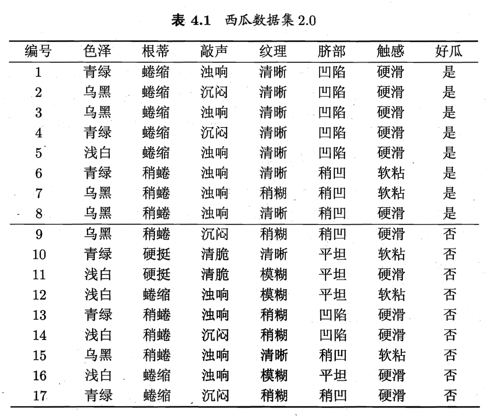
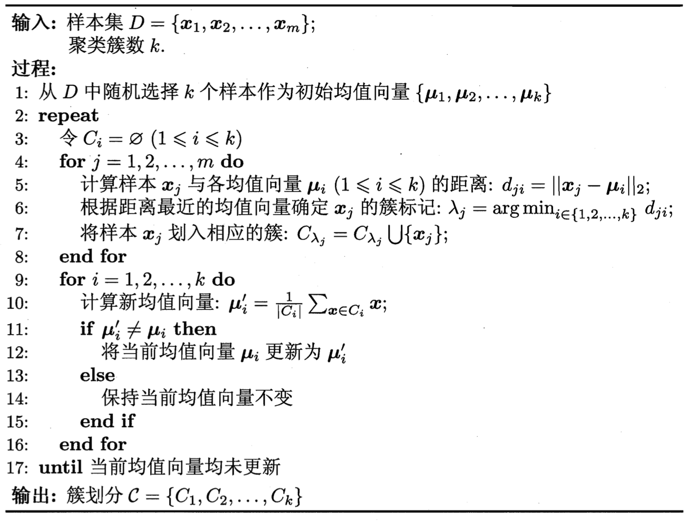
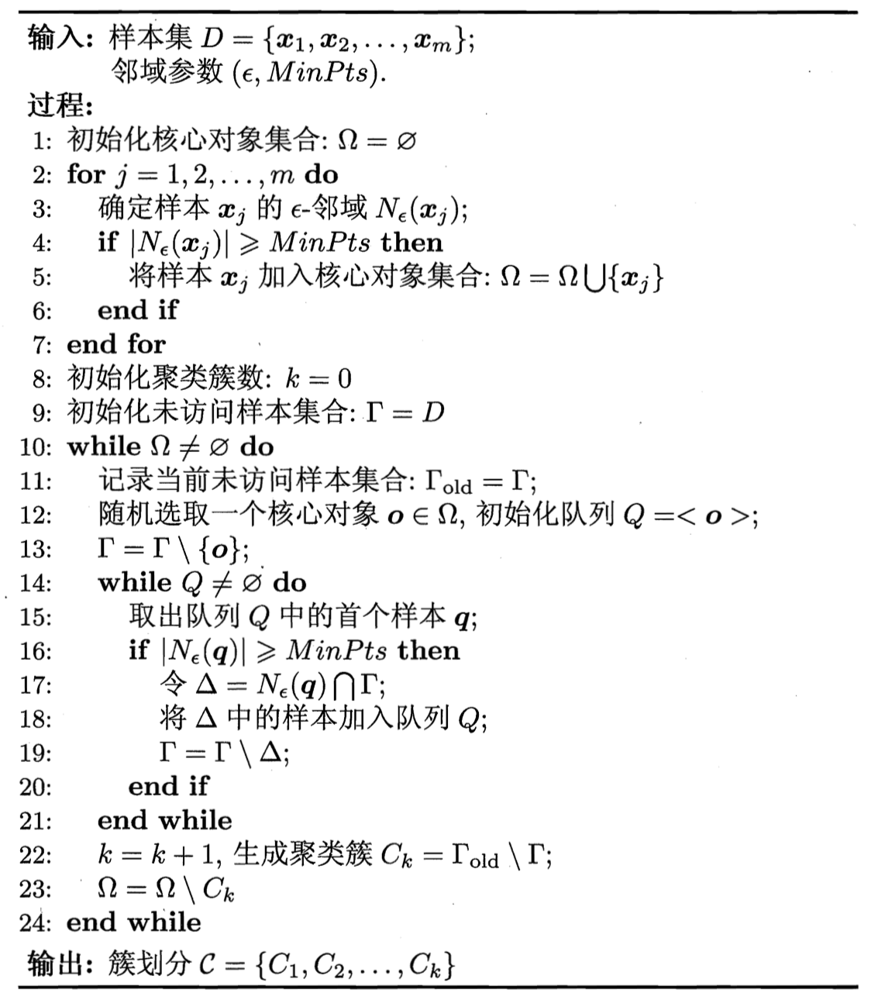
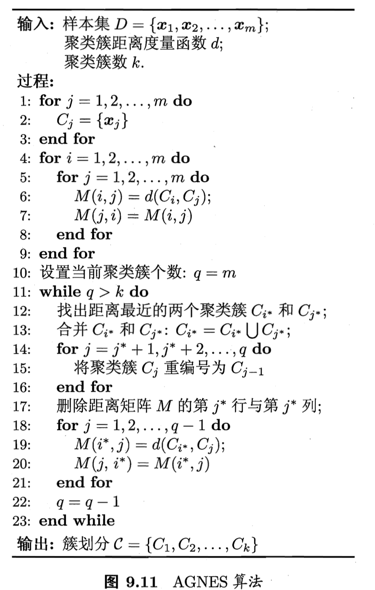

# 《机器学习公式详解》 （南瓜书）
## 第9章 聚类
##### 异步社区
本节主讲：秦州

---
#### 本节大纲
##### 异步社区
南瓜书对应章节：9.3, 9.4, 9.5, 9.6

1. 距离计算
2. k-means (原型聚类)
2. DBSCAN (密度聚类)
3. AGNES (层次聚类)

---
#### 聚类和距离计算
##### 异步社区
聚类：**物以类聚**。将相似的样本聚集到一起，使得**同一类簇的样本尽可能接近, 不同类簇的样本尽可能远离**。

对“距离”的定义：
1. 非负性：$\operatorname{dist}\left(\boldsymbol{x}_{i}, \boldsymbol{x}_{j}\right) \geqslant 0$
2. 同一性：$\operatorname{dist}\left(\boldsymbol{x}_{i}, \boldsymbol{x}_{j}\right) = 0$ 当且仅当 $\boldsymbol{x}_{i}= \boldsymbol{x}_{j}$
3. 对称性：$
\operatorname{dist}\left(\boldsymbol{x}_{i}, \boldsymbol{x}_{j}\right)=\operatorname{dist}\left(\boldsymbol{x}_{j}, \boldsymbol{x}_{i}\right)
$
4. 直递性：$\operatorname{dist}\left(\boldsymbol{x}_{i}, \boldsymbol{x}_{j}\right) \leqslant \operatorname{dist}\left(\boldsymbol{x}_{i}, \boldsymbol{x}_{k}\right)+\operatorname{dist}\left(\boldsymbol{x}_{k}, \boldsymbol{x}_{j}\right)$

---
#### 常用的距离度量 - 连续/离散有序
##### 异步社区
明可夫斯基距离(Minkowski distance)

$$
\operatorname{dist}_{\mathrm{mk}}\left(\boldsymbol{x}_{i}, \boldsymbol{x}_{j}\right)=\left(\sum_{u=1}^{n}\left|x_{i u}-x_{j u}\right|^{p}\right)^{\frac{1}{p}}
$$

$p=2$ 退化成欧式距离(Euclidean distance)
$$
\operatorname{dist}_{\operatorname{ed}}\left(\boldsymbol{x}_{i}, \boldsymbol{x}_{j}\right)=\left\|\boldsymbol{x}_{i}-\boldsymbol{x}_{j}\right\|_{2}=\sqrt{\sum_{u=1}^{n}\left|x_{i u}-x_{j u}\right|^{2}}
$$

$p=1$ 退化成曼哈顿距离(Manhattan distance)

$$
\operatorname{dist}_{\operatorname{man}}\left(\boldsymbol{x}_{i}, \boldsymbol{x}_{j}\right)=\left\|\boldsymbol{x}_{i}-\boldsymbol{x}_{j}\right\|_{1}=\sum_{u=1}^{n}\left|x_{i u}-x_{j u}\right|
$$

---
#### 常用的距离度量 - 离散无序

VDM（Value Difference Metric）度量。
$$
\operatorname{VDM}_{p}(a, b)=\sum_{i=1}^{k}\left|\frac{m_{u, a, i}}{m_{u, a}}-\frac{m_{u, b, i}}{m_{u, b}}\right|^{p}
$$

---
#### kmeans （原型聚类）
##### 异步社区
原型（prototype）指类结构能通过一组典型的特例刻画。比如男、女类似的。
给定样本集$D=\left\{\boldsymbol{x}_{1}, \boldsymbol{x}_{2}, \ldots, \boldsymbol{x}_{m}\right\}$，k均值算法针对聚类所得簇划分$\mathcal{C}=\left\{C_{1}, C_{2}, \ldots, C_{k}\right\}$，求解最小化平方误差问题
$$
E=\sum_{i=1}^{k} \sum_{\boldsymbol{x} \in C_{i}}\left\|\boldsymbol{x}-\boldsymbol{\mu}_{i}\right\|_{2}^{2}
$$
其中$
\boldsymbol{\mu}_{i}=\frac{1}{\left|C_{i}\right|} \sum_{\boldsymbol{x} \in C_{i}} \boldsymbol{x}
$表示簇$\mathcal{C}_i$的均值向量。
求解改式需要考虑样本集$D$所有可能的划分，是一个NP-hard问题。一般来说，我们采用迭代算法求解近似划分。

---
#### kmeans 算法和示例
##### 异步社区

---
#### GBDT 和 XGBoost
##### 异步社区

GBDT 以Gradient Boosting为基本框架，并使用CART作为个体学习器。
1. 针对回归问题，GBDT 采用平方损失作为损失函数。$\operatorname{err}\left(H_t(\boldsymbol{x}), f(\boldsymbol{x})\right)=\left(H_t(\boldsymbol{x})-f(\boldsymbol{x})\right)^2$
2. 针对二分类问题，GBDT采用对数似然损失函数 $\operatorname{err}\left(H_t(\boldsymbol{x}), f(\boldsymbol{x})\right)=\log\left(1+\exp\left(-H_t(\boldsymbol{x})f\boldsymbol{x}\right)\right)$

XGBoost 即eXtreme Gradient Boosting的缩写，XGBoost 与GBDT的关系可以类比为LIBSVM和SVM的关系，即XGBoost是GBDT的一种高效实现和改进。

---
#### 密度聚类
##### 异步社区
密度聚类假设聚类结构能够通过样本分布的紧密程度确定。它从样本密度的角度考察样本间的可连接性，并基于可连接样本不断扩展聚类簇得到最终的聚类结果。
DBSCAN是密度聚类的代表之一。它基于一组邻域参数$\left(\epsilon, MinPts\right)$刻画样本分布的紧密程度。关于DBSCAN的几个概念如下：
1. $\epsilon$-邻域，和样本$x$距离不超过$\epsilon$的样本集合
2. 核心对象：如果样本$x$的$\epsilon$-邻域内至少包含$MinPts$个样本，则$x$是一个核心对象。
3. 密度直达：$x_j$位于核心对象$x_i$的$\epsilon$-邻域内，则称$x_i$密度可达$x_j$
4. 密度可达：若存在样本序列 $x_i, p_1, p_2, ..., p_n, x_j$，其中$p_i$密度直达$p_{i+1}$，则称$x_i$密度可达$x_j$
5. 密度相连：如上序列中任意两点密度相连

---
#### DBSCAN

DBSCN定义的簇为：最大密度相连的样本集合为一个簇。
1. 连接性：同一个簇内任意两样本必然密度相连
2. 最大性：密度可达的两个样本必定属于同一个簇

---
#### 层次聚类
##### 异步社区

层次聚类试图将数据划分成为不同的层次，因此聚类结果呈现明显的树状结构。
AGNES是一种采用自底向上聚合策略的层次聚类算法。在聚类过程中不断合并距离最近的两个类簇，知道达到预期的聚类簇数目。算法的核心在于如何定义类簇中之间的距离。
1. 最小距离（两个簇最近样本距离）：$d_{\min }\left(C_{i}, C_{j}\right)=\min _{x \in C_{i}, \boldsymbol{z} \in C_{j}} \operatorname{dist}(\boldsymbol{x}, \boldsymbol{z})$
2. 最大距离（两个簇最远样本距离）：$d_{\max }\left(C_{i}, C_{j}\right)=\max _{x \in C_{i}, \boldsymbol{z} \in C_{j}} \operatorname{dist}(\boldsymbol{x}, \boldsymbol{z})$
3. 平均距离（两个簇两两样本距离均值）：
$$d_{\mathrm{avg}}\left(C_{i}, C_{j}\right)=\frac{1}{\left|C_{i}\right|\left|C_{j}\right|} \sum_{\boldsymbol{x} \in C_{i}} \sum_{\boldsymbol{z} \in C_{j}} \operatorname{dist}(\boldsymbol{x}, \boldsymbol{z})$$

---
#### AGNES 算法

---
#### 预告
##### 异步社区
下一节：降维和度量学习
西瓜书对应章节：第10章

---
#### 结束语
##### 异步社区

欢迎加入【南瓜书读者交流群】，我们将在群里进行答疑、勘误、本次直播回放、本次直播PPT发放、下次直播通知等最新资源发放和活动通知。
加入步骤：
1. 关注公众号【Datawhale】，发送【南瓜书】三个字获取机器人“小豚”的微信二维码
2. 添加“小豚”为微信好友，然后对“小豚”发送【南瓜书】三个字即可自动邀请进群

